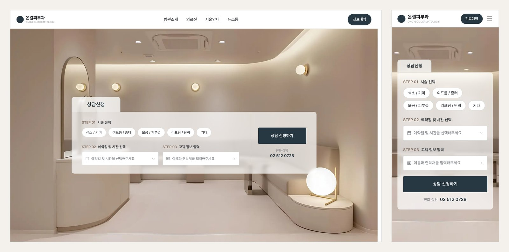
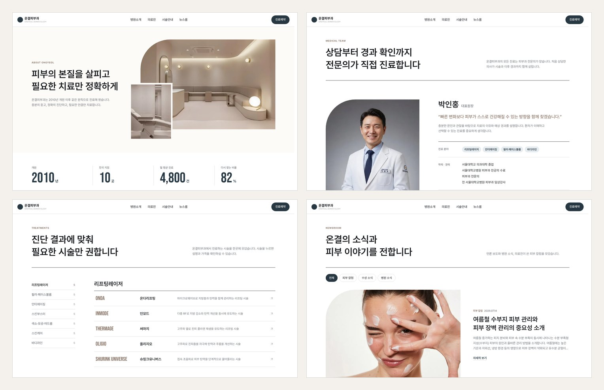

# 온결피부과 홈페이지

Figma 시안을 Next.js · TypeScript · SCSS Module로 옮긴 **반응형 병원 홈페이지 퍼블리싱** 작업입니다.

- **배포 주소**: https://ongyeol-smoky.vercel.app
- **작업 기간**: 2026.09 ~ 2026.10
- **작업 인원**: 1명 (개인 작업)
- **작업 범위**: 디자인 · 퍼블리싱 · 배포 / 퍼블리싱 · 배포

> 포트폴리오용으로 만든 가상의 병원 사이트입니다. 병원 이름, 의료진, 주소, 전화번호를 비롯한 모든 정보는 지어낸 것이며 실제 병원과 관련이 없습니다.



## 사용 기술

| 구분 | 기술 | 쓴 이유 |
| --- | --- | --- |
| 프레임워크 | Next.js 16 (App Router), React 19 | 페이지별 주소 구성과 이미지 최적화, 정적 페이지 생성 |
| 언어 | TypeScript | 컴포넌트에 넘기는 값과 데이터 구조의 실수를 미리 확인 |
| 스타일 | SCSS Module | 컴포넌트별로 클래스 이름이 겹치지 않고, 믹스인으로 반응형 규칙을 재사용 |
| 글꼴 | Pretendard, Bebas Neue | 본문은 Pretendard, 숫자와 영문 제목은 Bebas Neue |
| 지도 | Kakao Maps JavaScript SDK | 오시는 길 지도 |
| 배포 | Vercel | GitHub에 올리면 자동 배포 |

## 페이지 구성

| 페이지 | 주소 | 내용 |
| --- | --- | --- |
| 메인 | `/` | 상담 신청, 진료 원칙, 시술 카테고리, 의료진, 진료 과정, 뉴스룸, 병원 공간, 오시는 길 |
| 병원 소개 | `/about` | 소개 글, 숫자로 보는 병원, 자주 묻는 질문 |
| 의료진 | `/doctors` | 의료진별 진료 분야, 학력·경력, 진료 일정표 |
| 시술 안내 | `/treatments` | 카테고리 7개, 시술 35개 목록 |
| 시술 상세 | `/treatments/[slug]` | 시술 설명과 옵션 선택 |
| 뉴스룸 | `/news` | 분류별로 걸러 보는 글 목록 |
| 뉴스 상세 | `/news/[slug]` | 본문, 이전 글·다음 글 |
| 그 밖 | `/privacy`, `/terms`, 404 | 개인정보처리방침, 이용약관, 없는 주소 안내 |



## 신경 쓴 부분

### 1. 반응형

- 기준점은 **1199px(태블릿)** 과 **767px(모바일)** 두 개로 정하고, `_mixins.scss`의 `tablet` · `mobile` 믹스인으로만 쓰도록 통일했습니다.
- 좌우 여백, 섹션 간격, 제목 크기처럼 화면 폭에 따라 바뀌는 값은 `_tokens.scss`의 CSS 변수(`--gutter`, `--section-y`, `--fs-title`)로 두었습니다. 기준점에서 변수 값만 바뀌므로 컴포넌트마다 같은 미디어쿼리를 반복하지 않습니다.
- 방문 정보, 페이지 제목 영역처럼 "자리가 부족하면 아랫줄로 내려가면 되는" 곳은 미디어쿼리 대신 `flex-wrap`과 `flex-basis`로 처리했습니다.
- 시술 안내 목록은 화면 폭이 아니라 **목록이 놓인 영역의 폭**에 따라 바뀌어야 해서 컨테이너 쿼리(`@container`)를 썼습니다.
- 터치 기기에서 hover 상태가 남지 않도록 hover 스타일은 `@media (hover: hover)` 안에서만 적용했습니다.

### 2. 웹 접근성

- 제목은 `h1 → h2 → h3` 순서를 건너뛰지 않고, `header` · `nav` · `main` · `footer`로 영역을 구분했습니다.
- 의미가 있는 사진에는 대체 텍스트를 쓰고, 장식용 사진은 `alt=""`로 비웠습니다.
- 눌린 상태가 있는 버튼에는 `aria-pressed`, 펼침 메뉴에는 `aria-expanded`, 현재 위치에는 `aria-current`를 넣었습니다. 뉴스룸에서 분류를 바꾸면 `aria-live`로 결과가 바뀌었음을 알립니다.
- 자동으로 넘어가는 뉴스 캐러셀에는 **정지 버튼**을 두고, 마우스를 올리거나 포커스가 들어가면 멈추게 했습니다.
- 기기에서 "동작 줄이기"를 켜면 모든 등장 애니메이션이 꺼집니다(`prefers-reduced-motion`).
- 키보드로 이동할 때만 보이는 포커스 표시(`:focus-visible`)를 넣었고, 모바일 메뉴는 `Esc`로 닫을 수 있습니다. 모달은 `<dialog>` 요소로 만들었습니다.
- Footer의 저작권 글자색은 시안 값의 명도 대비가 4.19:1이어서, 기준(4.5:1)을 넘도록 조금 밝게 조정했습니다.

### 3. 움직임

- 페이지마다 움직임이 제각각이지 않도록 **"가림막 뒤에서 드러난다"** 는 한 가지 방식으로 통일했습니다. 제목은 한 줄씩 아래에서 올라오고, 사진은 아래에서 위로 열립니다.
- 스크롤해서 보일 때 나타나는 동작은 `IntersectionObserver`를 쓰는 `Reveal` 컴포넌트 하나로 처리했습니다.
- 자바스크립트가 꺼져 있어도 내용이 보이도록, 처음에 숨기는 스타일은 `@media (scripting: enabled)` 안에만 두었습니다.

### 4. 코드 구조

- 색, 간격, 모서리 값은 `_tokens.scss`에 디자인 토큰으로 모으고, 자주 쓰는 글자 스타일과 반응형 규칙은 `_mixins.scss`의 믹스인으로 만들었습니다.
- 캐러셀 동작(현재 쪽, 진행률, 자동 넘김)은 `useCarousel` 훅으로 분리해 뉴스룸과 병원 공간 섹션에서 함께 씁니다. 넘김 자체는 CSS `scroll-snap`으로 처리했습니다.
- 시술, 의료진, 뉴스 내용은 `data.ts`로 분리했고, 상세 페이지는 이 데이터에서 주소를 만들어 미리 생성합니다(`generateStaticParams`).
- 사진은 `next/image`로 넣어 화면 크기에 맞는 크기로 불러옵니다.


## 폴더 구조

```
src
├─ app                 페이지 (주소와 폴더가 1:1)
│  ├─ about            병원 소개
│  ├─ doctors          의료진
│  ├─ treatments       시술 안내, [slug] 시술 상세
│  ├─ news             뉴스룸, [slug] 뉴스 상세
│  ├─ privacy, terms   개인정보처리방침, 이용약관
│  ├─ layout.tsx       모든 페이지 공통 틀 (Header, Footer)
│  └─ not-found.tsx    404
├─ components          화면 조각 (컴포넌트마다 .tsx + .module.scss)
├─ hooks               useCarousel
├─ styles              _tokens.scss, _mixins.scss, _reset.scss, globals.scss
└─ assets              사진
```

## 안내

- 상담 신청 화면에 입력한 내용은 어디에도 전송되거나 저장되지 않습니다.
